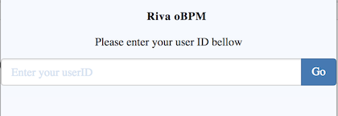
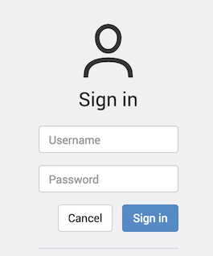
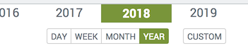
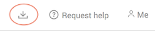

## Riva OBPM - Download your data 

Step by step process,

#### 1. Prerequisites

- You will need for this process to know your Riva **UserId** and the **Password**
- A computer, this process cannot be done on most mobiles or tablets.

#### 2. identify yourself

- 2.1 open https://sw.obpmprod.ch/access/signinhub.html

  - Enter your user ID 

    

- 2.2 on the next web application - SignIn

  

  ####  3. Data retrieval

  When signed in,  you will be presented a user interface to navigate and explore all your data.,

  - 3.1 on the time selector at the bottom of the page select "YEAR" and "2018"

  

  -  3.2 on the top right corner click the download button and confirm the prompt to download all your measures for 2018 in CSV format

 -  3.3 in the "Download" folder of your computer you will find a "Pryv_export.csv" file with all your measures for 2018. You can open this file with most spreadsheet software such as Microsoft Excel.
